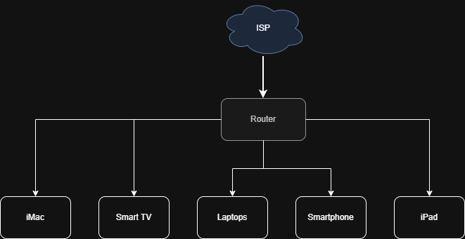

# Home Network Documentation

**Author:** Lateefah Alli
**Date:** March 31, 2026
**Version:** 1.0

## 1. Physical Topology

The home network follows a star topology, where all devices are connected to a central wireless router.

### Devices and Connections:

* ISP is connected to Router
* Router is connected to iMac via Wi-Fi
* Router is connected to Smart TV via Wi-Fi
* Router is connected to Laptops via Wi-Fi
* Router is connected to iPad via Wi-Fi
* Router is connected to Smartphones via Wi-Fi

## 2. Logical Topology

The network operates on a private IP addressing scheme using a star topology, where all devices communicate through a router.

* Network Type: Star Topology
* IP Range: 192.168.1.0/24
* Communication Method: Devices communicate through the router

## 3. Addressing Documentation

| Device     | IP Address   | Type   |
| ---------- | ------------ | ------ |
| Router     | 192.168.1.1  | Static |
| iMac       | DHCP Assigned| DHCP   |
| Smartphones| DHCP Assigned| DHCP   |
| Smart TV   | DHCP Assigned| DHCP   |
| iPad       | DHCP Assigned| DHCP   |
|Laptops     | DHCP Assigned| DHCP   |

### 4. Network Settings:

* Subnet Mask: 255.255.255.0
* Default Gateway: 192.168.1.1
* DHCP Range: 192.168.1.100 – 192.168.1.200
* DNS Server: Provided by the Internet Service Provider (ISP)

## 5. Network Devices & Services

### Devices:

* Wireless Router
* Internet Service Provider (ISP) Modem
* Laptops
* iMac
* Smartphones
* Smart TV
* iPad

### Services:

* DHCP (Dynamic IP assignment)
* NAT (Network Address Translation for internet access)
* Wi-Fi (Wireless connectivity)
* DNS(Domain Name Resolution), provided by ISP. 

## 6. Device Configurations

### Router Configuration:

* SSID: Home_Network
* Security Type: WPA2/WPA3
* DHCP: Enabled
* Firewall: Enabled

### iMac:

* DHCP enabled
* Connected via Wi-Fi

### Laptop & Mobile Devices:

* DHCP enabled
* Connected via Wi-Fi

## 7. Storage of Passwords

Login credentials are stored securely using a password manager.

* Tool Used: Bitwarden
* Passwords are encrypted and not stored in plain text
* Two-factor authentication (2FA) is enabled for added security

No sensitive credentials are included in this documentation to maintain security.

## 8. Network Diagram

The network diagram was created using draw.io to visually represent both physical and logical topology of the home network. 

---

